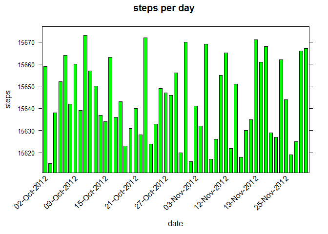
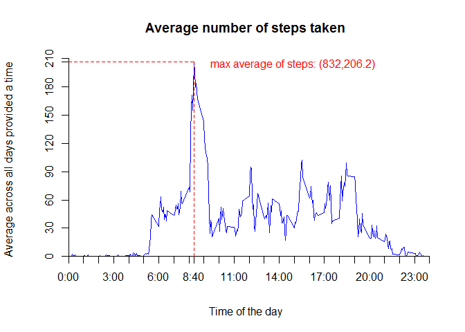
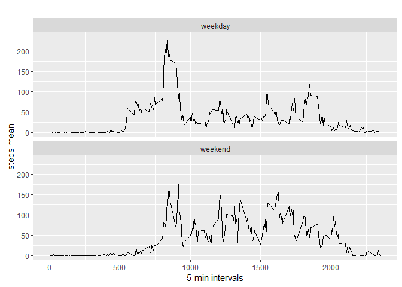

# Reproducible Research: Peer Assessment 1


## Install required packages for graphs, markdown, knitr etc.

```r
installPackages <- function(pkg){ 
   new.pkg <- pkg[!(pkg %in% installed.packages()[, "Package"])] 
   if (length(new.pkg)) 
     install.packages(new.pkg, dependencies = TRUE) 
   sapply(pkg, require, character.only = TRUE) 
 } 

packages <- c("knitr", "htmltools", "caTools", 'markdown', "plyr", "lattice", "data.table", "httr", "ggplot2" )
installPackages(packages)
```

```
## Loading required package: knitr
```

```
## Warning: package 'knitr' was built under R version 3.2.5
```

```
## Loading required package: htmltools
```

```
## Warning: package 'htmltools' was built under R version 3.2.5
```

```
## Loading required package: caTools
```

```
## Warning: package 'caTools' was built under R version 3.2.5
```

```
## Loading required package: markdown
```

```
## Warning: package 'markdown' was built under R version 3.2.5
```

```
## Loading required package: plyr
```

```
## Loading required package: lattice
```

```
## Loading required package: data.table
```

```
## Loading required package: httr
```

```
## Loading required package: ggplot2
```

```
## Warning: package 'ggplot2' was built under R version 3.2.4
```

```
##      knitr  htmltools    caTools   markdown       plyr    lattice 
##       TRUE       TRUE       TRUE       TRUE       TRUE       TRUE 
## data.table       httr    ggplot2 
##       TRUE       TRUE       TRUE
```


## Loading and preprocessing the data
Show any code that is needed to

1) Load the data (i.e. `read.csv()`)

2) Process/transform the data (if necessary) into a format suitable for your analysis


```r
fileURL <- "https://d396qusza40orc.cloudfront.net/repdata%2Fdata%2Factivity.zip"

#create a data directory for activity file
dataDir <- "data"
if(!file.exists(dataDir)){
  dir.create(dataDir)
} 

#create a figure directory for graphs
figureDir <- "figure" 
if(!file.exists(figureDir)){
  dir.create(figureDir)
}

zip <- paste(getwd(), "/activity.zip", sep = "")
if(!file.exists(zip)){
    download.file(fileURL, zip, mode="wb")
}

dataFile <- paste(getwd(), "/data/activity.csv", sep = "")
if(!file.exists(dataFile)){
    unzip(zip, list = FALSE, overwrite = FALSE, exdir = dataDir)
}

activity <- read.table(file = dataFile, header = TRUE, sep = ",")
```


## What is mean total number of steps taken per day?
For this part of the assignment, you can ignore the missing values in the dataset.

1) Calculate the total number of steps taken per day
2) If you do not understand the difference between a histogram and a barplot, research the difference between them. Make a histogram of the total number of steps taken each day
3) Calculate and report the mean and median of the total number of steps taken per day
    


```r
activity$daily <- as.POSIXct(with(activity, paste(date, paste(interval %/% 100, interval %% 100, sep=":"))), format="%Y-%m-%d %H:%M",tz="")

stepsAggregate <- setNames(aggregate(steps~as.Date(date), activity, sum, na.rm = TRUE), c("date","steps"))

xaxis <- seq(1, nrow(stepsAggregate), by = 6)

scaleProp <- list(x = list(rot = 45, cex = 1.0, labels = format(stepsAggregate$date, "%d-%b-%Y")[xaxis], at = xaxis))

barchart(date ~ steps, data = stepsAggregate, main = "steps per day", ylab = "steps", xlab = "date", scales = scaleProp, horizontal = F, col="green")
```



```r
paste("mean:", mean(stepsAggregate$steps))
```

```
## [1] "mean: 10766.1886792453"
```

```r
paste("median:", median(stepsAggregate$steps))
```

```
## [1] "median: 10765"
```


## What is the average daily activity pattern?
1) Make a time series plot (i.e. type = "l") of the 5-minute interval (x-axis) and the average number of steps taken, averaged across all days (y-axis)
2) Which 5-minute interval, on average across all the days in the dataset, contains the maximum number of steps?
   

```r
timeSeriesData <- aggregate(steps ~ interval, data = activity, FUN = mean)

plot(timeSeriesData, type = "l", axes = F, xlab = "Time of the day", 
    ylab = "Average across all days provided a time", main = "Average number of steps taken", 
    col = "blue")

axis(1,at=c(seq(0,2400,100),835), label = paste(c(seq(0,24,1),8),c(rep(":00",25),":40"),sep=""), pos = 0)
axis(2, at=c(seq(0,210,30),206.2), label = c(seq(0,210,30),206.2), pos = 0)

maxSteps <- which.max(timeSeriesData$steps)
segments(832, 0, 832, 206.2, col = "red", lty = "dashed")
text(835,200, "max average of steps: (832,206.2)", col = "red", adj = c(-.1, -.1))
segments(0, 206.2, 832, 206.2, col = "red", lty = "dashed")
```



```r
timeSeriesData [maxSteps, ]
```

```
##     interval    steps
## 104      835 206.1698
```

```r
#which.max(timeSeriesData$steps)/12
paste(835, "is equivalent to 8.667 hours, this gives the maximum is reached at 8:40 am")
```

```
## [1] "835 is equivalent to 8.667 hours, this gives the maximum is reached at 8:40 am"
```


## Imputing missing values
Note that there are a number of days/intervals where there are missing values (coded as NA). The presence of missing days may introduce bias into some calculations or summaries of the data.

1) Calculate and report the total number of missing values in the dataset (i.e. the total number of rows with NAs)
2) Devise a strategy for filling in all of the missing values in the dataset. The strategy does not need to be sophisticated. For example, you could use the mean/median for that day, or the mean for that 5-minute interval, etc.
3) Create a new dataset that is equal to the original dataset but with the missing data filled in.
4) Make a histogram of the total number of steps taken each day and Calculate and report the mean and median total number of steps taken per day. Do these values differ from the estimates from the first part of the assignment? What is the impact of imputing missing data on the estimates of the total daily number of steps?


```r
paste("missing observations:", sum(is.na(activity$steps)))
```

```
## [1] "missing observations: 2304"
```

```r
"missing observations can be replaced with the sample mean instead of replacing them by zero (the 1st won't bias the estimates while the 2nd will)"
```

```
## [1] "missing observations can be replaced with the sample mean instead of replacing them by zero (the 1st won't bias the estimates while the 2nd will)"
```

```r
dataNew <- activity
dataNew[is.na(activity$steps), ]$steps <- mean(activity$steps)

dataNew$daily <- as.POSIXct(with(dataNew, paste(date, paste(interval %/% 100, interval %% 100, sep=":"))),
    			format="%Y-%m-%d %H:%M",tz="")

aggregateSteps <- setNames(aggregate(steps~as.Date(date), dataNew, sum, na.rm = TRUE), c("date","steps"))

xaxis <- seq(1, nrow(aggregateSteps), by = 6)

scaleProp1 <- list(x = list(rot = 45, cex = 1.0, labels = format(aggregateSteps$date, "%d-%b-%Y")[xaxis], at = xaxis))

barchart(date ~ steps, data = aggregateSteps, main = "steps per day", ylab = "steps", xlab = "date", scales = scaleProp1, horizontal = F)
```


```r
paste("mean:", mean(aggregateSteps$steps))
```

```
## [1] "mean: 10766.1886792453"
```

```r
paste("median:", median(aggregateSteps$steps))
```

```
## [1] "median: 10765"
```

```r
#find the difference with first part of assignment as below
paste("means difference:", mean(aggregateSteps$steps)-mean(stepsAggregate$steps))
```

```
## [1] "means difference: 0"
```

```r
paste("medians difference:", median(aggregateSteps$steps)-median(stepsAggregate$steps))
```

```
## [1] "medians difference: 0"
```


## Are there differences in activity patterns between weekdays and weekends?
For this part the weekdays() function may be of some help here. Use the dataset with the filled-in missing values for this part.

1) Create a new factor variable in the dataset with two levels – “weekday” and “weekend” indicating whether a given date is a weekday or weekend day.
2) Make a panel plot containing a time series plot (i.e. type = "l") of the 5-minute interval (x-axis) and the average number of steps taken, averaged across all weekday days or weekend days (y-axis). See the README file in the GitHub repository to see an example of what this plot should look like using simulated data.   


```r
str(dataNew)
```

```
## 'data.frame':	17568 obs. of  4 variables:
##  $ steps   : num  NA NA NA NA NA NA NA NA NA NA ...
##  $ date    : Factor w/ 61 levels "2012-10-01","2012-10-02",..: 1 1 1 1 1 1 1 1 1 1 ...
##  $ interval: int  0 5 10 15 20 25 30 35 40 45 ...
##  $ daily   : POSIXct, format: "2012-10-01 00:00:00" "2012-10-01 00:05:00" ...
```

```r
dataNew$date <- as.Date(dataNew$date, "%Y-%m-%d")
dataNew$day <- weekdays(dataNew$date)
dataNew$dayType <- c("weekday")

for (i in 1:nrow(dataNew)){
  if (dataNew$day[i] == "Saturday" || dataNew$day[i] == "Sunday"){
    dataNew$dayType[i] <- "weekend"
  }
}

dataNew$dayType <- as.factor(dataNew$dayType)
aggregateDayType <- aggregate(steps ~ interval+dayType, dataNew, mean)

qplot(interval, steps, data=aggregateDayType, geom=c("line"), xlab="5-min intervals", 
      ylab="steps mean", main="") + facet_wrap(~ dayType, ncol=1)
```



